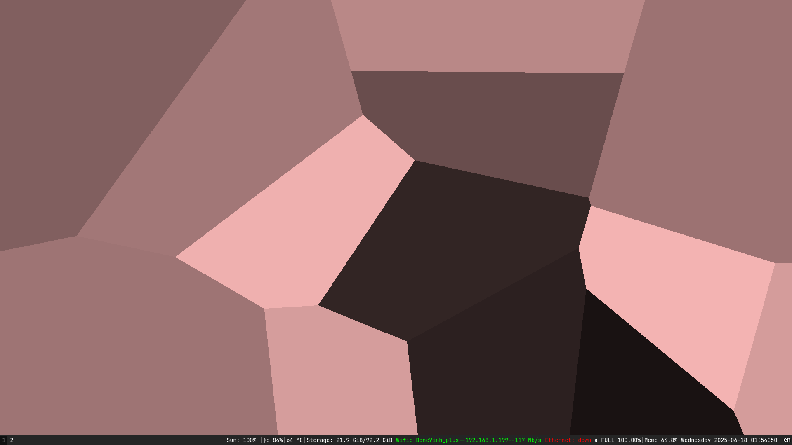

# Voronoi

Dynamic wallpaper for X11 using [Voronoi diagram](https://en.wikipedia.org/wiki/Voronoi_diagram) in [Nim](https://nim-lang.org/)

## Demo


## Quick start

```bash
$ nimble run voronoi [(wallpaper|window)] # default window
```
